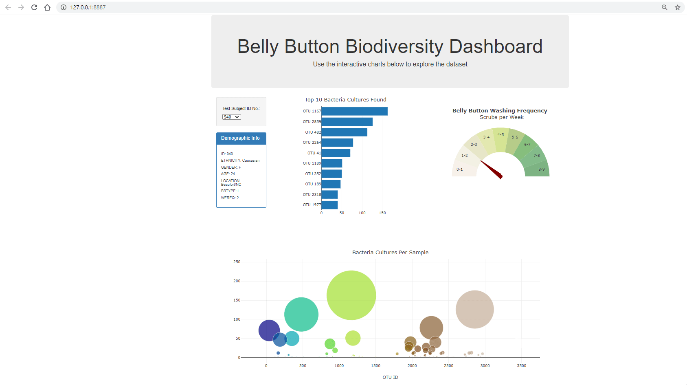
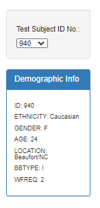
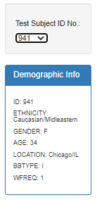
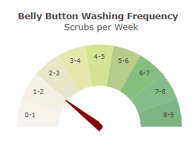

# biodiversity-analysis

## SUMMARY ##
* *Overview,*
* *App in action*
* *Task*
* *Technologies used*

## Overview ##

In this assignment, you will build an interactive dashboard to explore the Belly Button Biodiversity dataset, which catalogs the microbes that colonize human navels.
The dataset reveals that a small handful of microbial species (also called operational taxonomic units, or OTUs, in the study) were present in more than 70% of people, while the rest were relatively rare.

## App in Action ##

## Task ##
### Required ###
* Create a horizontal bar chart with a dropdown menu to display the top 10 OTUs found in that individual.
  * Use sample_values as the values for the bar chart.
  * Use otu_ids as the labels for the bar chart.
  * Use otu_labels as the hovertext for the chart.

* Create a bubble chart that displays each sample.
  * Use otu_ids for the x values.
  * Use sample_values for the y values.
  * Use sample_values for the marker size.
  * Use otu_ids for the marker colors.
  * Use otu_labels for the text values.

  
* Display the sample metadata, i.e., an individual's demographic information.
* Display each key-value pair from the metadata JSON object somewhere on the page.

### Optional ### 
* The following task is advanced and therefore optional.
* Adapt the Gauge Chart from https://plot.ly/javascript/gauge-charts/ to plot the weekly washing frequency of the individual.
* You will need to modify the example gauge code to account for values ranging from 0 through 9.
* Update the chart whenever a new sample is selected.

## Technologies used ##
* HTML 5
* CSS 3
* Javascript
* Bootstrap
* D3.json
  
## Authors ##
* Sylvain David - Data Analytics Bootcamp - Vanderbilt University - 2020
* About the Data: Hulcr, J. et al.(2012) A Jungle in There: Bacteria in Belly Buttons are Highly Diverse, but Predictable. Retrieved from: http://robdunnlab.com/projects/belly-button-biodiversity/results-and-data/